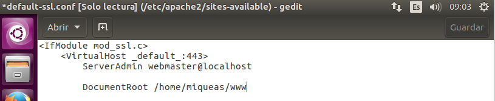
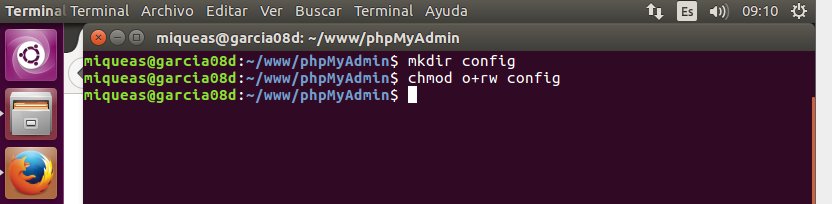
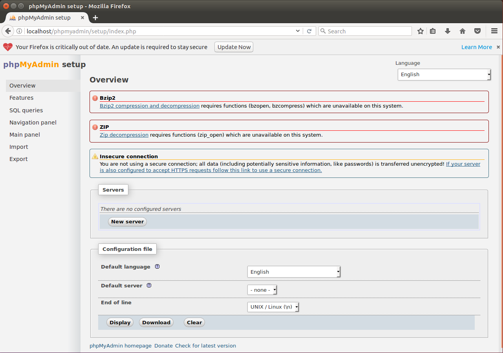

# Apache Linux

**Miqueas García González**

**Víctor Gabriel Carvajal Aróstegui**

En esta práctica vamos a instalar un servidores web en una máquina con Linux a la que le instalaremos Apache, PHP, MySQL y phpMyAdmin.
## 0. Instalación
Vamos a instalar los programas necesarios. Vamos a abrir una terminal y ejecutar los siguientes comandos:
'''bash
sudo apt-get install apache2
sudo apt-get install php5
sudo apt-get install mysql-server
sudo apt-get install php5-mysql
sudo apt-get install php5-gd
'''
Una vez instalado todo configuramos la carpeta raíz de la web que por defecto está en /var/www  `sudo gedit /etc/apache2/sites-available/default` Y reemplazamos /var/www/ por el directorio que querramos, guardamos y listo.

Vamos a descargar phpMyAdmin desde la web en su última versión. Lo ponemos en la ruta de nuestro servidor web y descomprimimos. Vamos a crear una carpeta config en el directorio del phpmyadmin y a otorgarle privilegios:

Luego nos metemos en: http://localhost/phpmyadmin/scripts/setup.php y aparecerá una web para configurarlo

Le damos a Add, escribimos la contraseña de mysql y también un usuario y contraseña para phpmyadmin. Añadimos y le damos a Save.
