# Servicio de Correo Electrónico

*En esta práctica vamos a configurar un servicio de email.*

Máquina virtual a usar: Windows12Server

## Instalando SMTP

Vamos a `Agregar roles y características` y lo instalamos desde ahí.

Habiéndolo instalado ahora vamos a configurarlo. Buscamos *IIS* en nuestro PC y nos llevará a esta ventana.

Configuramos como en la imagen de manera que establecemos la dirección IP de nuestra máquina a la dirección del servidor.

Pulsamos en `Acceso` y seguimos los pasos `Conexión` -> `Solo la lista a continuación` -> `Añadir` -> Establecemos la IP que deseemos. Esto sirve para limitar el acceso solo a mi ordenador.

Vamos a establecer un dominio externo. Si no queremos hacerlo lo dejamos como está. Pulsamos en `Entrega`.

Ahora establecemos algunas opciones en el cortafuegos. Hacemos una búsqueda de `Firewall`.

Por último le añadimos un nombre a la regla.

Cerramos el cortafuegos, reiniciamos y vamos a `Servicios` -> `Protocolo simple de transferencia` -> `Botón derecho y propiedades.`

Detenemos e iniciamos el servicio y le pulsamos en automático y ya tenemos nuestro servicio SMTP listo.

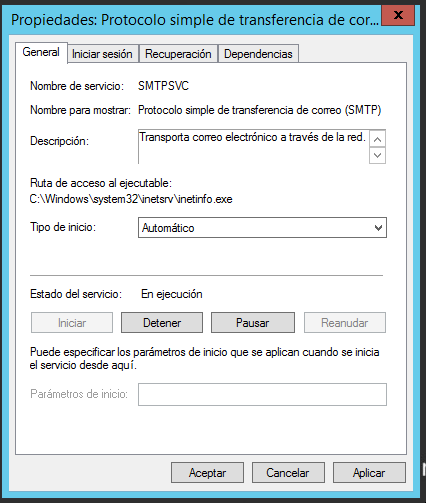

## Probar el servicio.

Una vez instalado el SMTP vamos a probar cómo funciona el servicio de correo. Para ello, he descargado el `Mozilla Thunderbird` que es un servicio de mensajería.

En nuestro correo le damos botón derecho y observamos nuestro servidor de salida.

Probaremos a enviar un mensaje a ver si funcionan todas nuestras configuraciones.

Y vemos que el mensaje llega.

# hMailServer

En esta práctica vamos a instalar y configurar el servicio *hMailServer*.

Máquinas virtuales - **Windows12Server**

## Configuración inicial.

Debemos instalar el servidor DNS primero.

Creamos dos zonas de búsqueda directa para el correo.

Las dos tienen que apuntar al propio servidor.

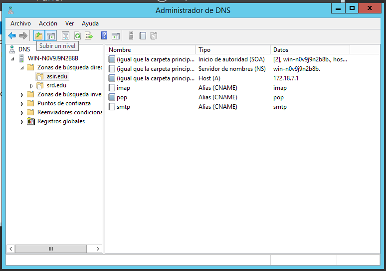

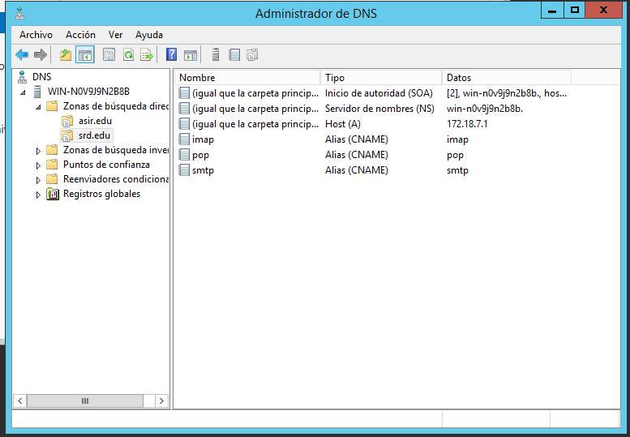

## hMailServer

Hecho esto, vamos a descargar de la página oficial https://www.hmailserver.com/ el servicio de correo.

En este paso nos crea una pequeña base de datos que viene predeterminada.

Una contraseña para el servidor. La nuestra es del 1 al 6.

Luego vamos a la configuración de hmail y establecemos los protocolos.

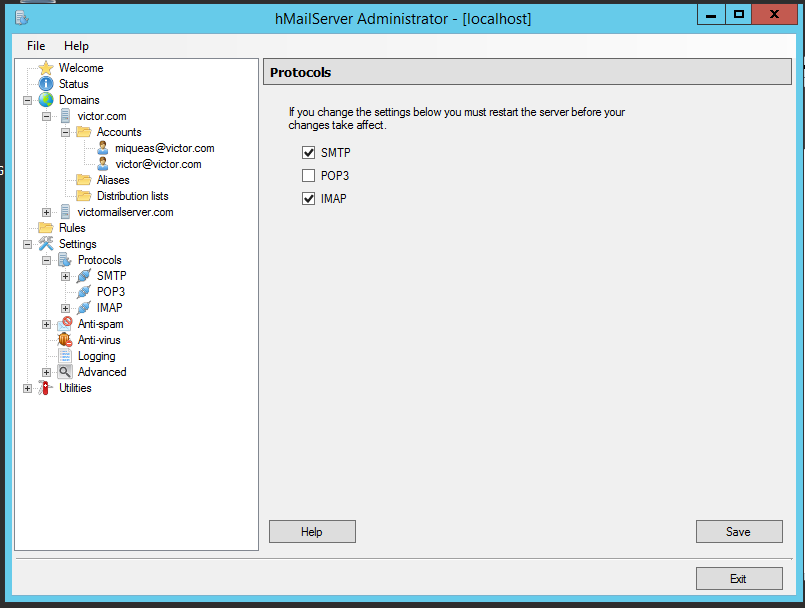

Configuramos SMTP.

Necesitamos establecer las direcciones de IP.

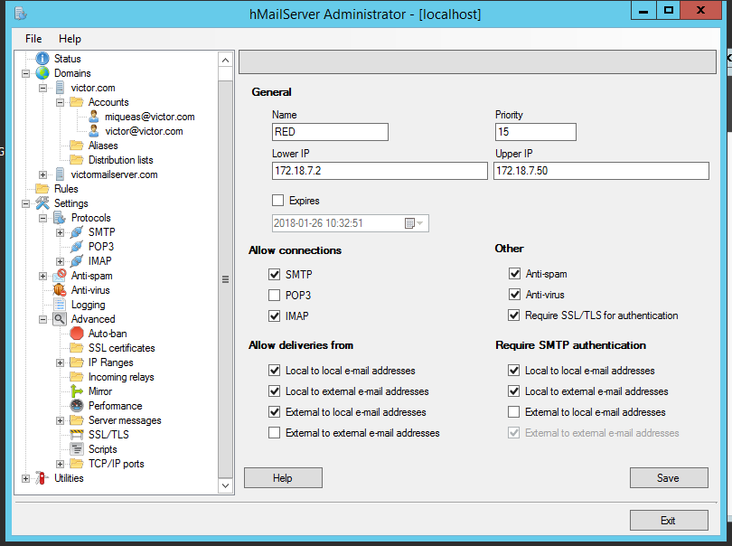

Viene bien desactivar el firewall para que funcione.

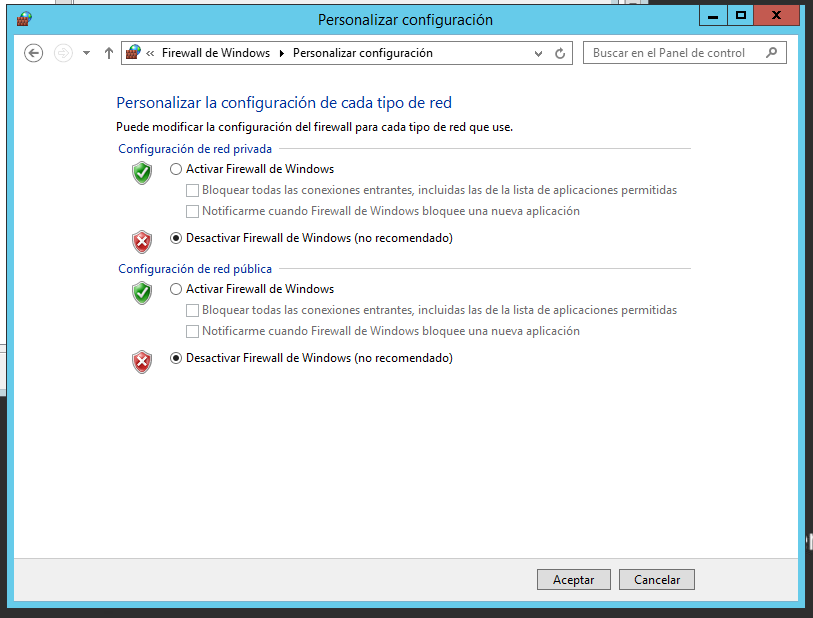

Hecho todo lo anterior, descargamos el programa `Thunderbird` que es una mensajería e introducimos el usuario que hemos creado.

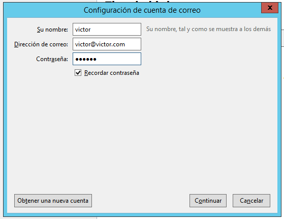

----------------------------

#### Posibles errores

En este caso primero instalamos esa característica.

Si no se consigue solventar así, desde agregar roles y características.

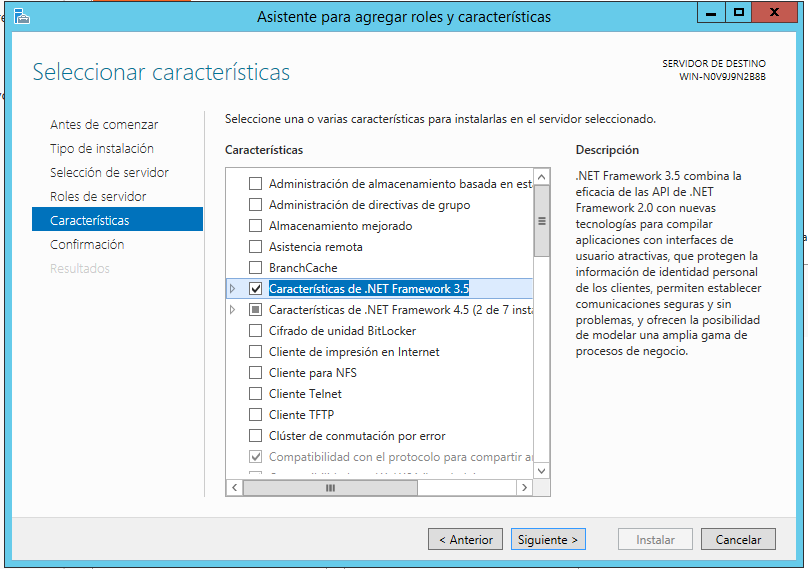

----------------------------

Una vez solventados los errores que puedan surgir, nos aparecerá una imagen como esta.

-----------------------------

**Nuevo error**

Si sale una pantalla de error debemos ir a `Archivos de programa x86` y eliminar la carpeta, desinstalar el programa para volverlo a instalar. Hecho esto aparecerá correctamente esta pantalla.

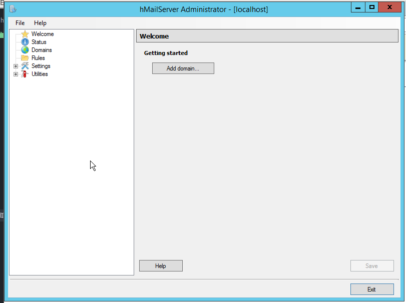

------------------------------

## Configurando el hMailServer

Creamos un dominio.

Creamos un usuario que se conecte a ese dominio.

## Instalando el servicio de correo

Para hacer uso de nuestro correo debemos tener un programa de mensajería. En nuestro caso será `Opera mail`.

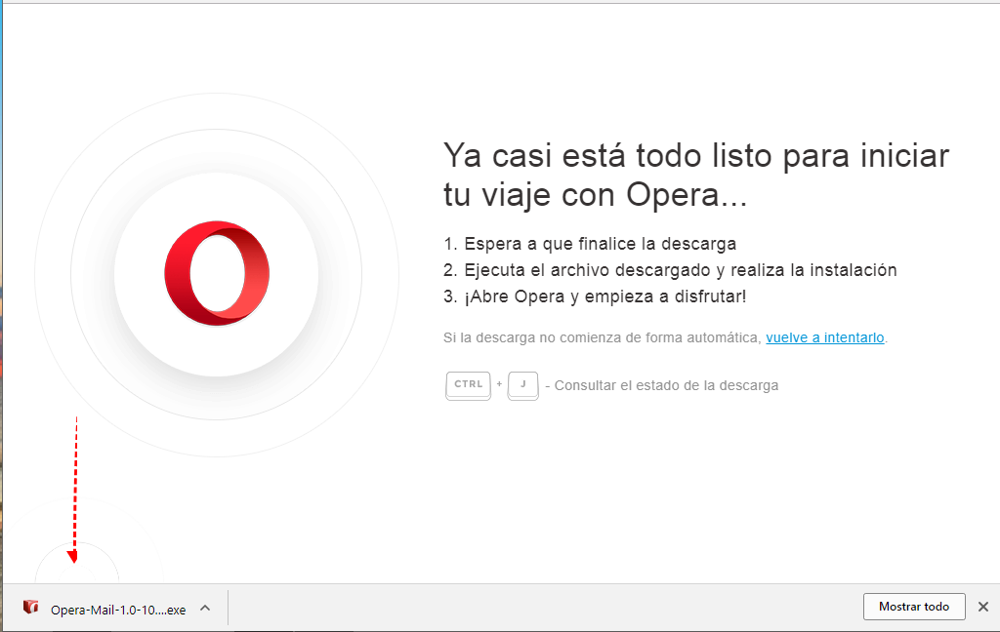

Agregamos la dirección de correo de nuestro hMailServer.

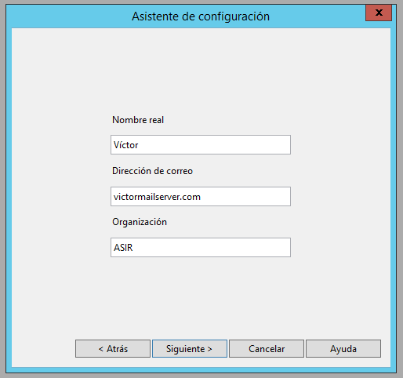

Y ya tenemos nuestro correo.

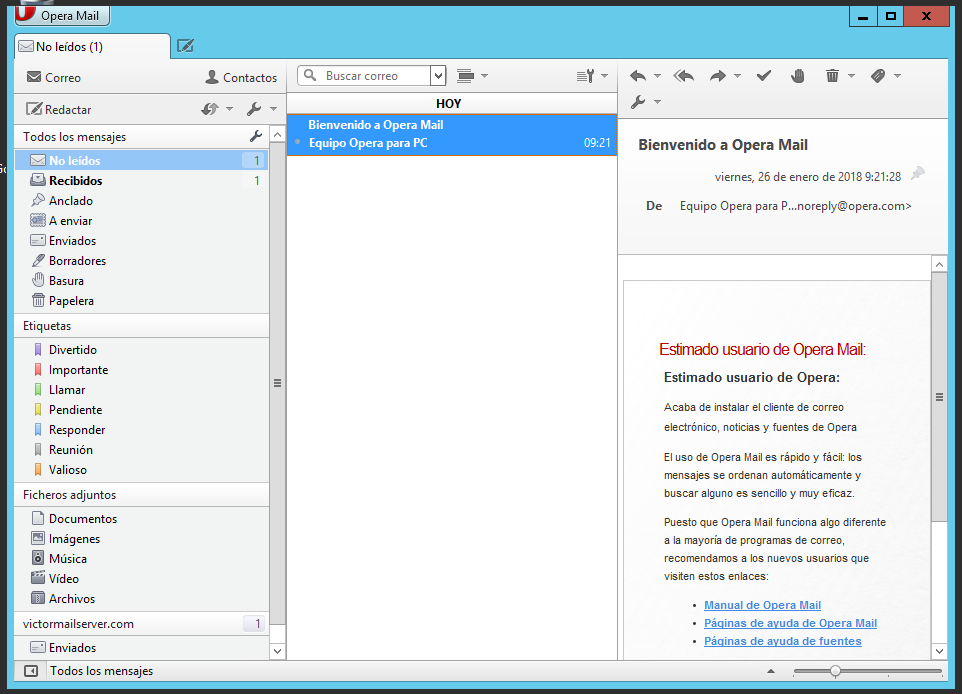

Probemos a mandar un correo.

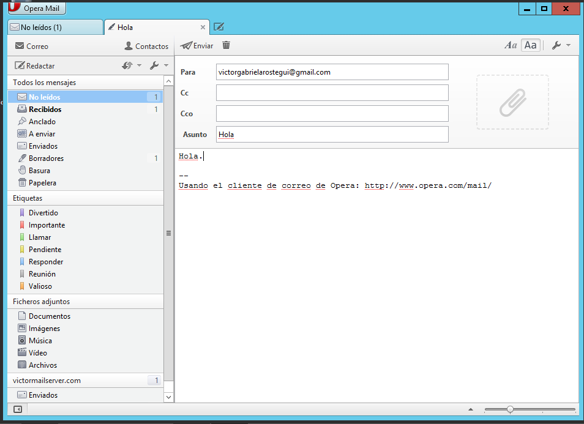
