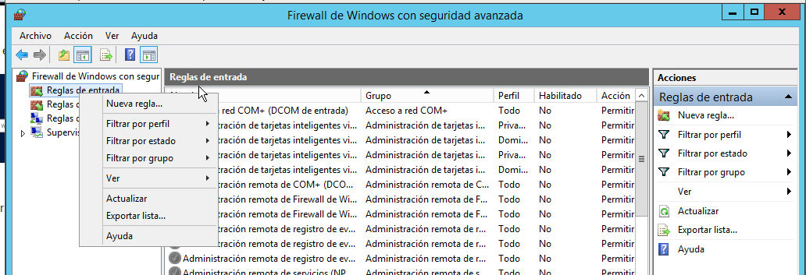

# Servicio de Correo Electrónico

*En esta práctica vamos a configurar un servicio de email.*

Máquina virtual a usar: Windows12Server

## Instalando SMTP

Vamos a `Agregar roles y características` y lo instalamos desde ahí.

Habiéndolo instalado ahora vamos a configurarlo. Buscamos *IIS* en nuestro PC y nos llevará a esta ventana.

Configuramos como en la imagen de manera que establecemos la dirección IP de nuestra máquina a la dirección del servidor.

Pulsamos en `Acceso` y seguimos los pasos `Conexión` -> `Solo la lista a continuación` -> `Añadir` -> Establecemos la IP que deseemos. Esto sirve para limitar el acceso solo a mi ordenador.

Vamos a establecer un dominio externo. Si no queremos hacerlo lo dejamos como está. Pulsamos en `Entrega`.

Ahora establecemos algunas opciones en el cortafuegos. Hacemos una búsqueda de `Firewall`.

Por último le añadimos un nombre a la regla.

Cerramos el cortafuegos, reiniciamos y vamos a `Servicios` -> `Protocolo simple de transferencia` -> `Botón derecho y propiedades.`

Detenemos e iniciamos el servicio y le pulsamos en automático y ya tenemos nuestro servicio SMTP listo.

## Probar el servicio.

Una vez instalado el SMTP vamos a probar cómo funciona el servicio de correo. Para ello, he descargado el `Mozilla Thunderbird` que es un servicio de mensajería.

En nuestro correo le damos botón derecho y observamos nuestro servidor de salida.

Probaremos a enviar un mensaje a ver si funcionan todas nuestras configuraciones.

Y vemos que el mensaje llega.

