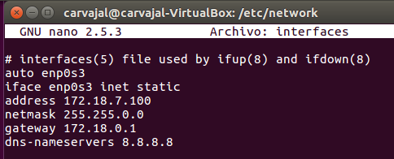

# Configuración de DHCP en Linux

En este informe vamos a instalar y configurar un servicio DHCP en un sistema operativo Linux Ubuntu.

- Lo primero que haremos será ir a nuestra terminal y ejecutar el comando `sudo apt-get install isc-dhcp-server`

- Antes de continuar con el DHCP, debemos ir a nuestra configuración de red y poner una IP estática. `/etc/network/interfaces`

- Podemos reiniciar aunque también podemos usar un comando para reiniciar la conexión desde la terminal `sudo /etc/init.d/networking restart`

- Una vez terminadas las configuraciones iremos a `/etc/dhcp/dhcpd.conf`

- Entramos en ese archivo e insertamos la información de nuestra IP,  máscara y el rango de IPs que va a escoger para los equipos.

- Existe la posibilidad de que, al intentar encender el servicio, nos de un problema. `sudo service isc-dhcp-server status`

