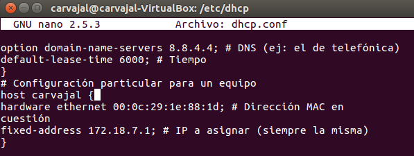

# Configuración de DHCP en Linux

En este informe vamos a instalar y configurar un servicio DHCP en un sistema operativo Linux Ubuntu.

- Lo primero que haremos será ir a nuestra terminal y ejecutar el comando `sudo apt-get install isc-dhcp-server`

- Una vez terminada la instalación iremos a `/etc/dhcp/dhcpd.conf`

- Entramos en ese archivo e insertamos la información de nuestra IP,  máscara y el rango de IPs que va a escoger para los equipos.

