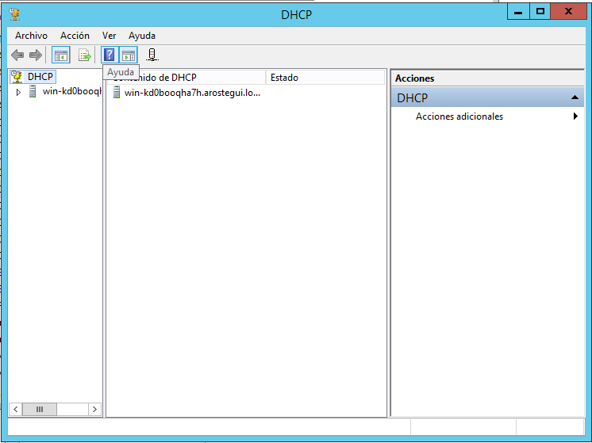
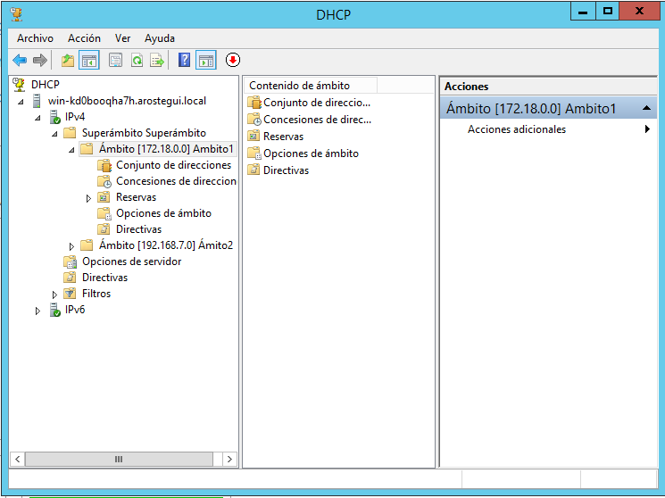
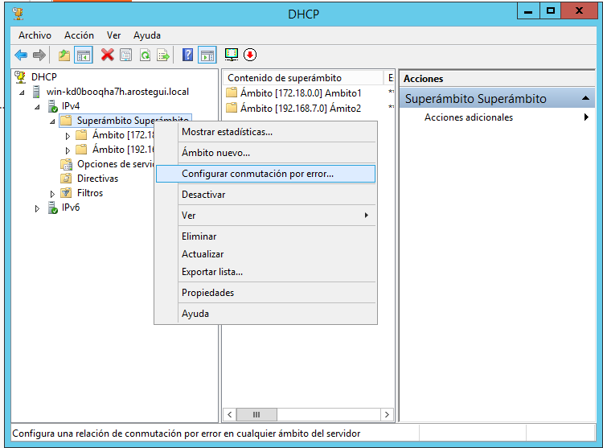
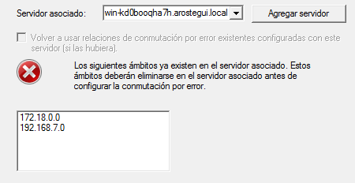

# DHCP Failover

Vamos a crear unas máquinas virtuales con **Windows Server 2012**. El objetivo de esta práctica es que la información se pase de una máquina a otra de modo que, si una máquina se cuelga, consiga la información de otra máquina.

`Inicio -> Herramientas administrativas -> DHCP`

`Pestaña -> IPV4 -> Ámbitos`

`Botón derecho -> Conmutación de errores`

Es necesario tener **dos servidores** a partir de este paso debido a que nos pude salir el siguiente error.

La misión de la práctica es observar cómo cuando una máquina se enciende, se apaga la otra. El ámbito que había en la apagada se traspasará a la que está encendida.
