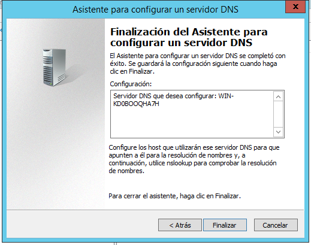
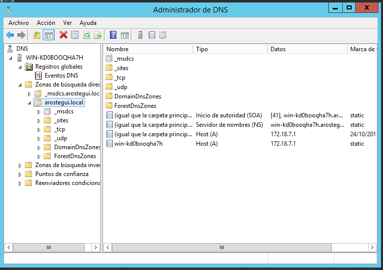

# Instalación y configuración DNS W2012

Debido a que ya tenemos nuestro servidor con **Active Directory**, debemos seguir estas pautas a la hora de crear nuestro DNS.

En la siguiente imagen vemos que existen dos archivos tipo **A** que redireccionan como servidor la dirección de esta máquina virtual.

Ahora observamos que, en la máquina virtual cliente, podemos obtener servicios de Internet a partir de usar el DNS de este servidor.
