# FTP

*En esta práctica vamos a configurar el servicio FTP tanto en Windows Server como en Linux.*

## Windows - MV Windows12Server

Procederemos a instalar el FTP con IIS.

## Linux - MV UbuntuServer

Instalamos el **vsftpd**.

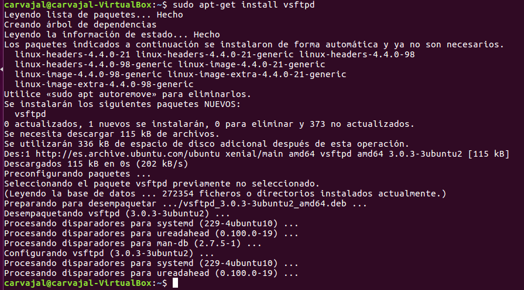

El fichero de configuración está en **/etc**.

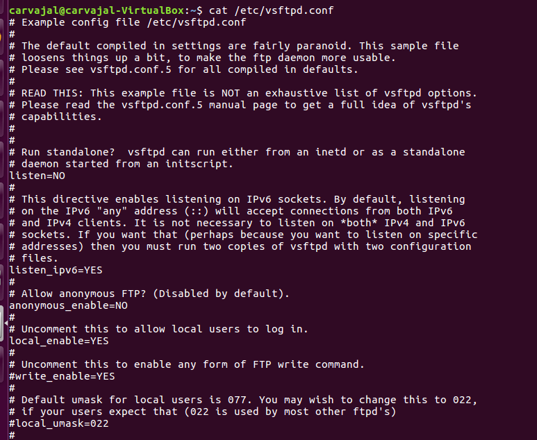

Ahora, crearemos un nuevo usuario de FTP.

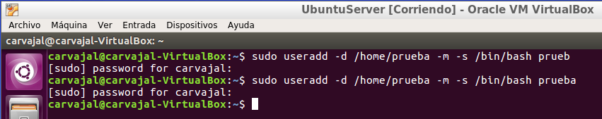

Le proporcionamos una clave.

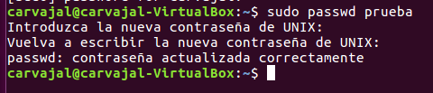

A continuación, unos ejemplos de comandos de FTP en Linux.

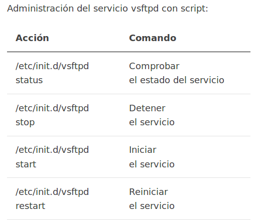

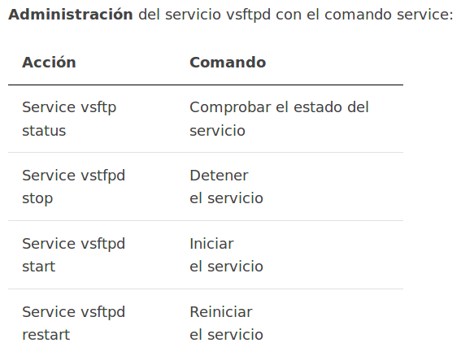

El archivo `/etc/ftpusers` contiene una lista de los usuarios del sistema a los que se deniega el acceso mediante ftp.

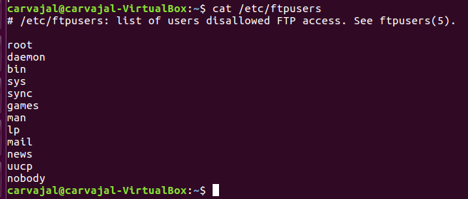

El archivo `/var/log/vsftpd.log` registra la información sobre las conexiones ftp establecidas.

Ahora vamos a:

#### Enjaular usuarios

Hacemos una copia de seguridad del fichero de configuración.

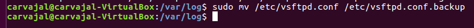

Ahora vamos a `/etc/vsftpd.conf` y añadimos la siguiente configuración al final del archivo.

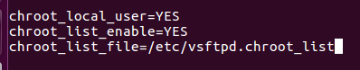

A continuación, creamos el fichero siguiente y ponemos nuestro usuario para que quede enjaulado.

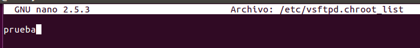

Reiniciamos el servicio.

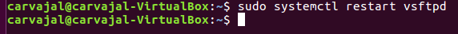

Ya tendríamos nuestro usuario registrado.

#### Usuarios anónimos.

Si se realiza una conexión anónima, se tiene acceso a la carpeta `/srv/ftp` que será compartida para todos los accesos anónimos.

Creamos un fichero en esta carpeta.

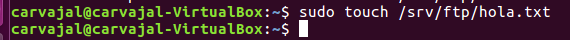

Editamos el archivo de configuración para permitir el acceso a usuarios anónimos.

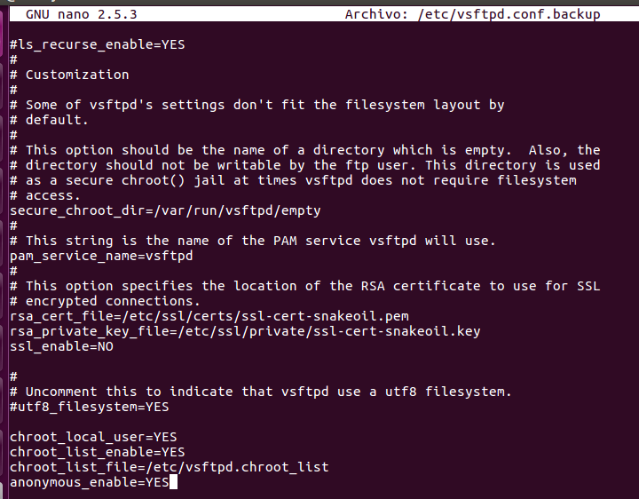

Reiniciamos el servicio y listo.

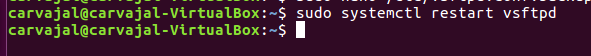
