# FTP

*En esta práctica vamos a configurar el servicio FTP tanto en Windows Server como en Linux.*

## Windows - MV Windows12Server

Procederemos a instalar el FTP con IIS.

Vamos a `Agregar roles y características`.

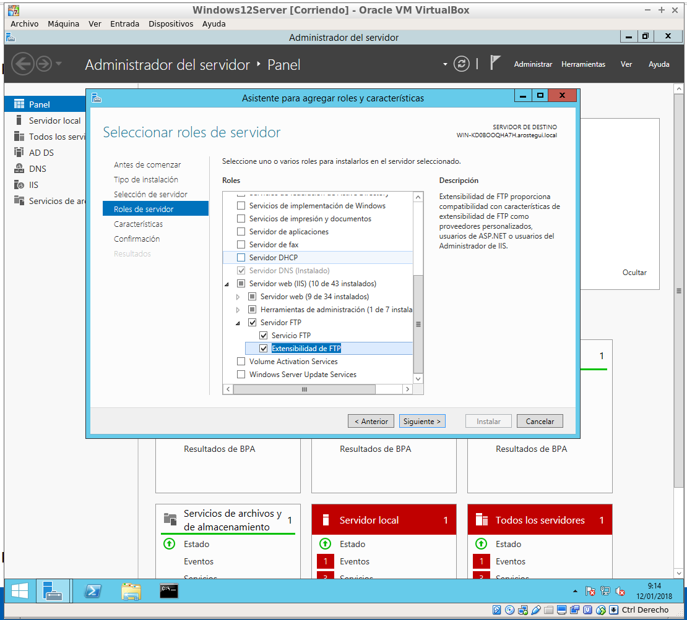

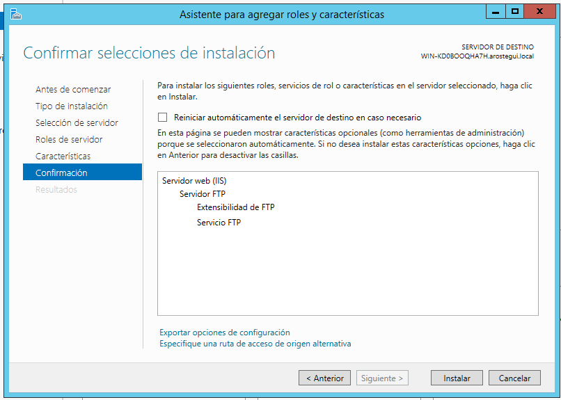

Después de instalarlo, vamos a IIS y seguimos estos pasos.

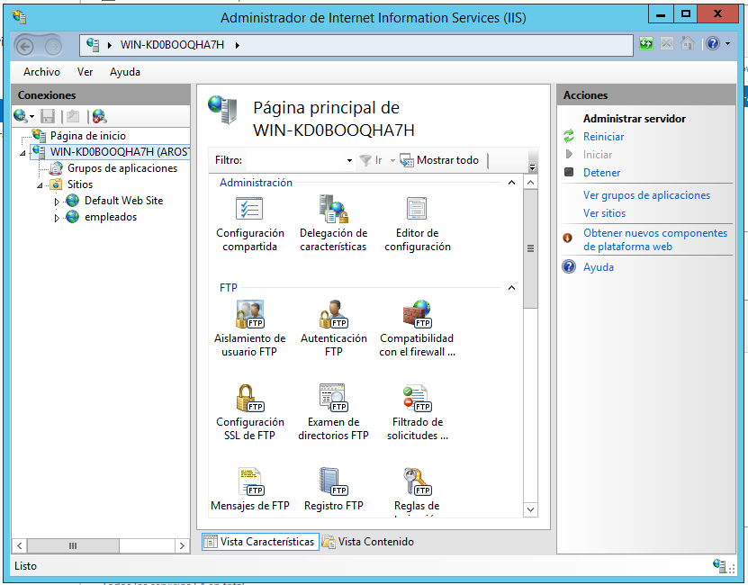

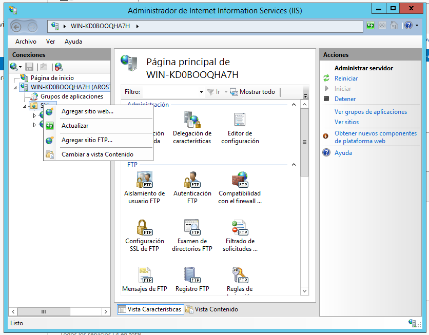

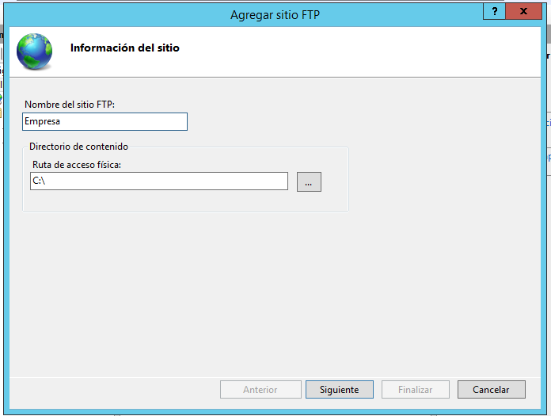

*En el paso siguiente hay que estar seguro de que existe la configuración correcta en el DNS.*

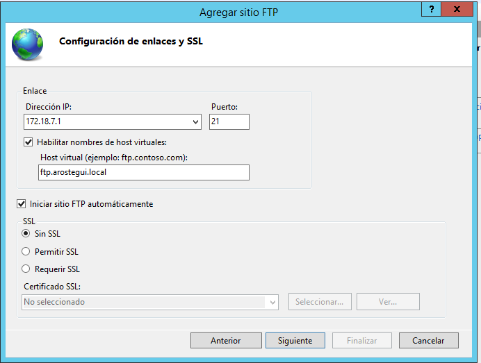

En la siguiente imagen se tilda la opción `Básica` por que interesa que los usuarios se conecten con su usuario y contraseña y no de manera anónima.

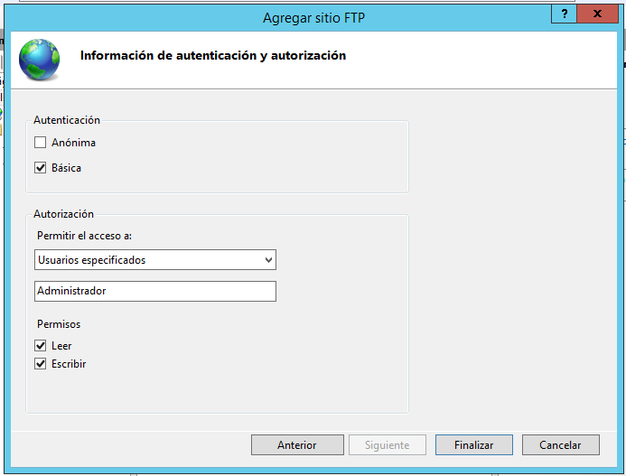

Ahora vamos a **configurar los valores predeterminados de FTP**.

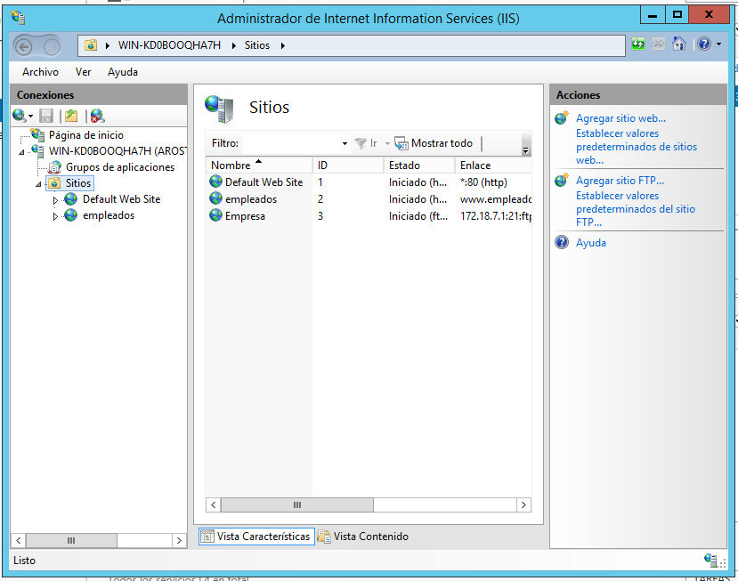

En el panel de `Acciones` pulsamos en `Establecer valores predeterminados`.

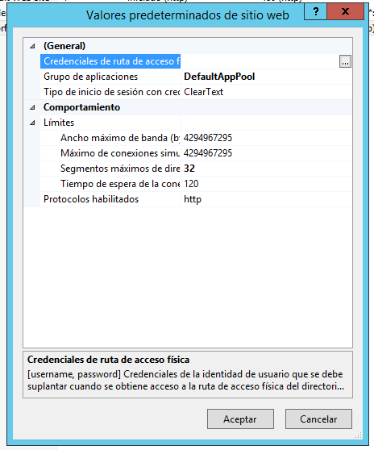

Establecemos un usuario para conectarnos.

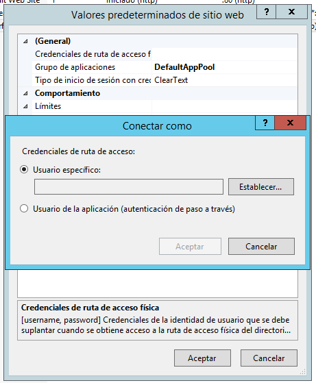

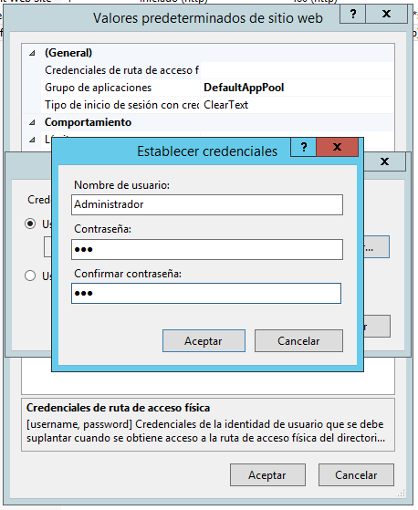

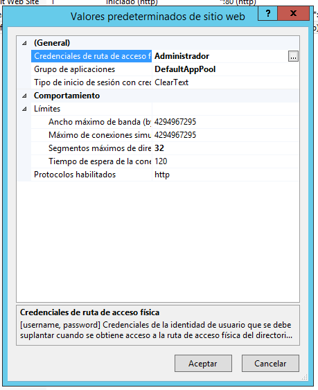

Ahora vamos a **configurar la compatibilidad con el firewall de FTP**. Para ello, volvemos al IIS.

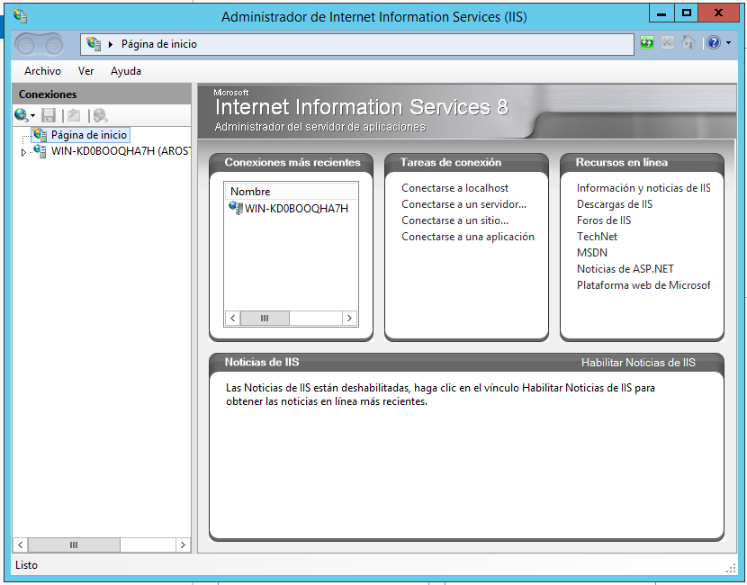

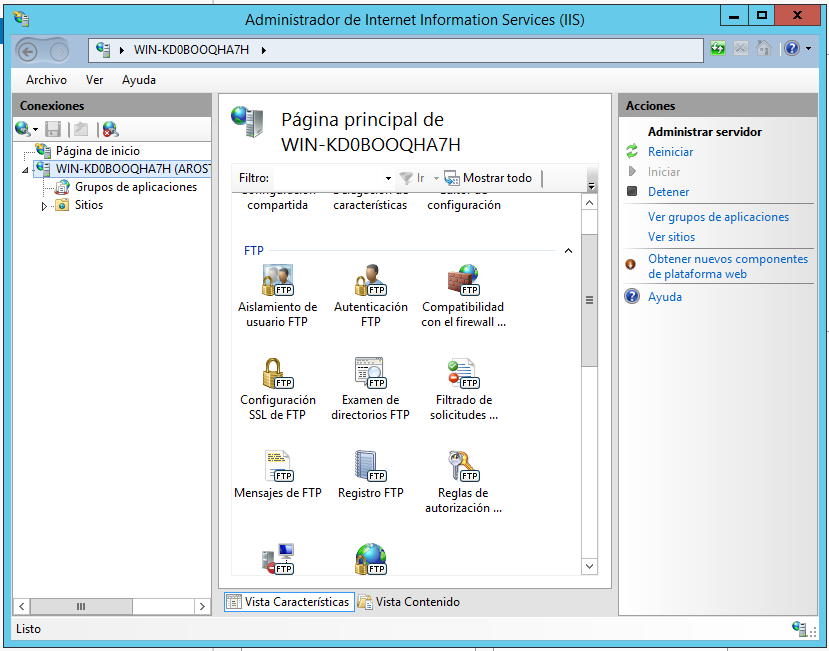

Accedemos a `Compatibilidad con el firewall`.

Usamos el intervalo 0-0 para usar los puertos predeterminados y la IP del firewall externo de Windows.

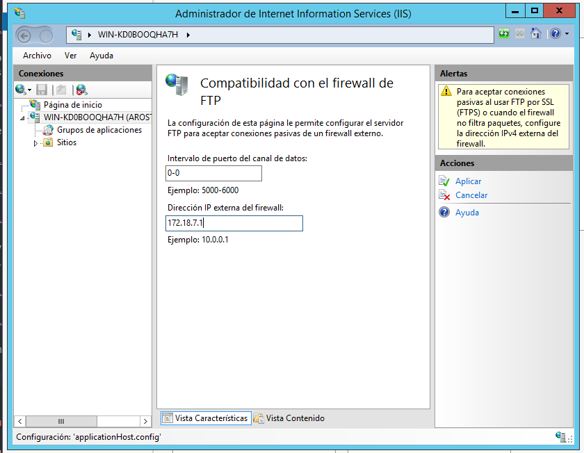

#### Configuramos el aislamiento de usuario.

Volvemos al IIS. Configuramos los usuarios.

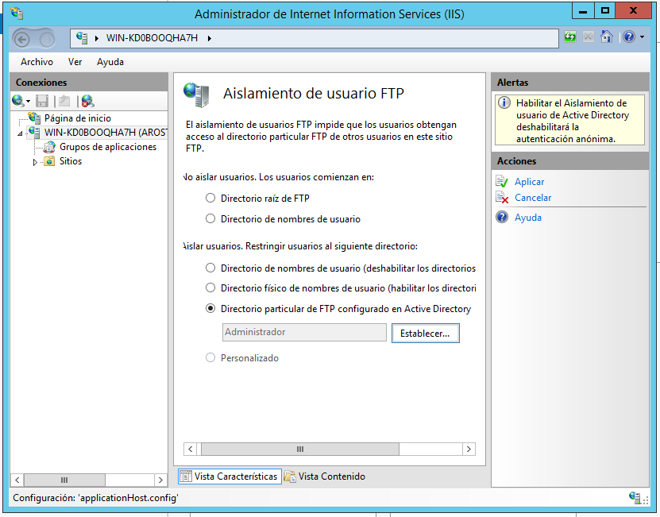

#### Configurar las opciones de exploración de directorios.

`Filtrado de solicitudes`.

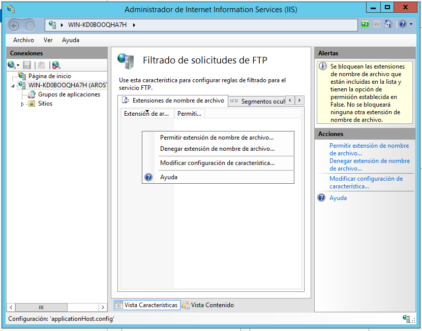

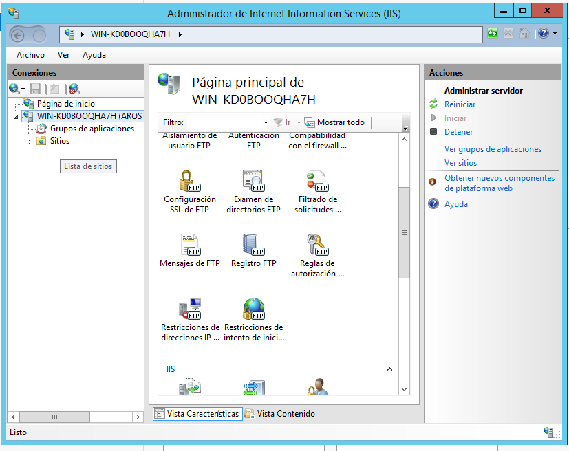

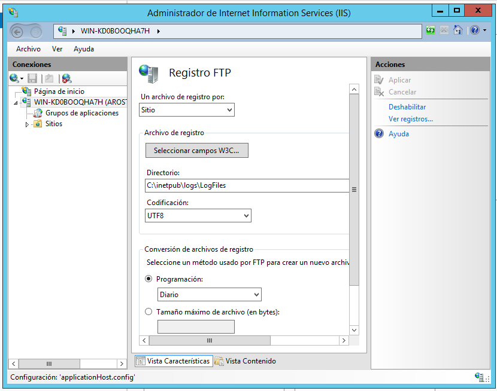

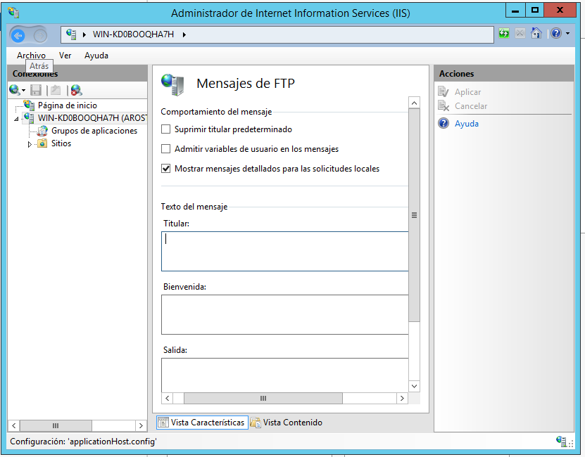

## Linux - MV UbuntuServer

Instalamos el **vsftpd**.

El fichero de configuración está en **/etc**.

Ahora, crearemos un nuevo usuario de FTP.

Le proporcionamos una clave.

A continuación, unos ejemplos de comandos de FTP en Linux.

El archivo `/etc/ftpusers` contiene una lista de los usuarios del sistema a los que se deniega el acceso mediante ftp.

El archivo `/var/log/vsftpd.log` registra la información sobre las conexiones ftp establecidas.

Ahora vamos a:

#### Enjaular usuarios

Hacemos una copia de seguridad del fichero de configuración.

Ahora vamos a `/etc/vsftpd.conf` y añadimos la siguiente configuración al final del archivo.

A continuación, creamos el fichero siguiente y ponemos nuestro usuario para que quede enjaulado.

Reiniciamos el servicio.

Ya tendríamos nuestro usuario registrado.

#### Usuarios anónimos.

Si se realiza una conexión anónima, se tiene acceso a la carpeta `/srv/ftp` que será compartida para todos los accesos anónimos.

Creamos un fichero en esta carpeta.

Editamos el archivo de configuración para permitir el acceso a usuarios anónimos.

Reiniciamos el servicio y listo.

