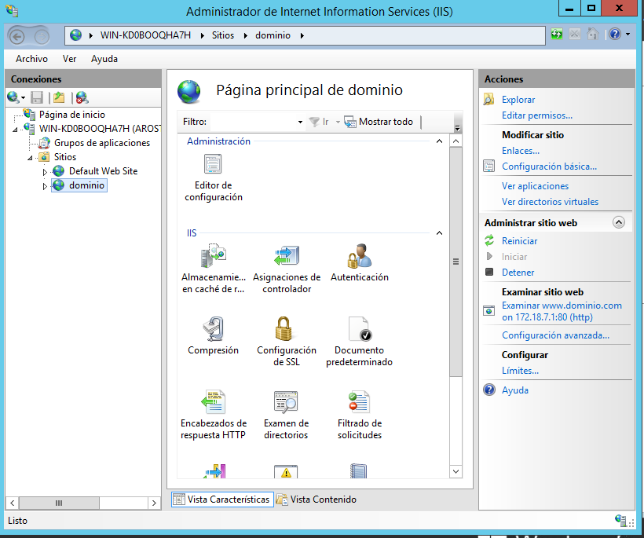

# Internet Information Server.

Empezaremos agregando roles de servidor para instalar **IIS**.

Una vez instalado el IIS, haremos una prueba de localhost para visualizar la página por defecto.

Hacemos una prueba desde la máquina cliente hasta la dirección IP del servidor y vemos que está operativa.

Podemos observar que, desde la máquina cliente, dirigiéndonos a **localhost** no entramos en la página. Esto es por que aún no está configurado de manera que el servidor no ofrece resolución de nombres.

Una vez hecho el paso anterior e interactuando con los archivos en **C:\\inetpub\wwwroot** hemos hecho un cambio en la página principal de nuestro archivo.

Crearemos una carpeta en este destino en el que irán imágenes y cambiaremos un poco la página como hemos visto antes.

Ahora crearemos un sitio web nuevo desde **Administrador de IIS**.

Podemos observar que la página creada anteriormente funciona.

En la siguiente imagen podemos obervar la ruta en la que está registrado nuestro sitio web.

Ahora procederemos a crear un subdominio.

