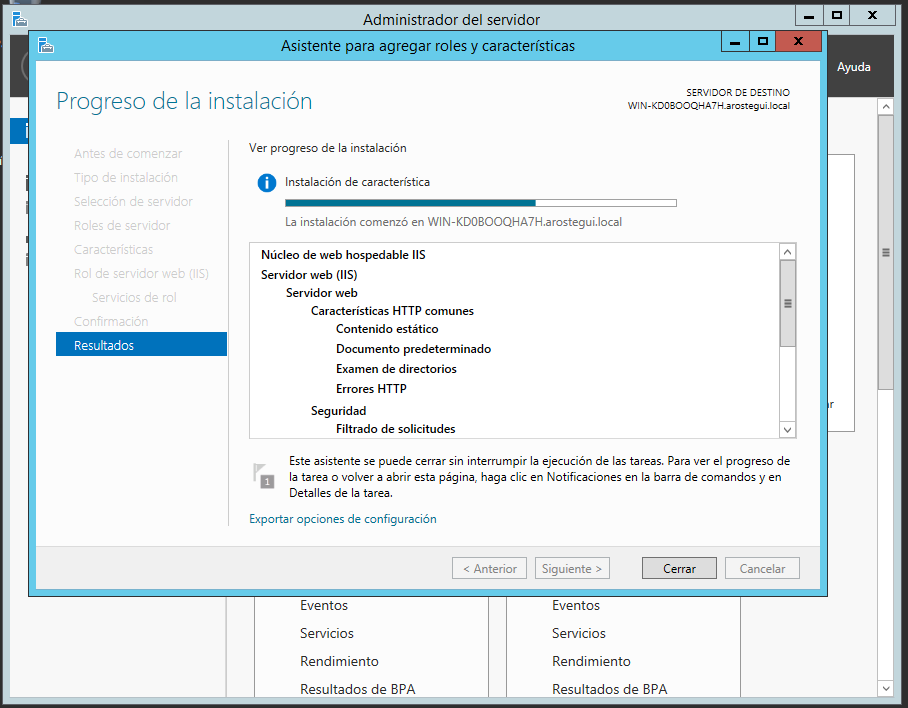

# IIS_IV

* Creamos un nuevo sitio web con el IIS.

* En nuestro nuevo sitio web creado, insertamos (**Agregar directorio virtual**) una carpeta `empleados` con subcarpetas con diferentes usuarios.

*Para hacer todos los usuarios repetimos la misma instrucción.*

* Creamos un archivo **index.html** en cada una de las carpetas para observar que se puede entrar.

*Este paso se repite en todas las carpetas.*

* Deshabilitamos el acceso anónimo en nuestro sitio servidor. Una vez hecho en el servidor, para el resto de usuarios se deshabilita automáticamente.

* Debemos cambiar la configuración como **Autenticación Básica** en el servidor. Si no lo tenemos, debemos instalarlo.

* En **Active Directory** creamos distintos usuarios y un grpo en común.

