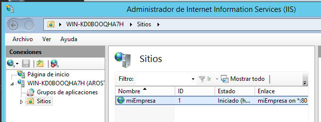

# IIS Avanzada

El primer paso es ir a la configuración de nuestra IIS en Windows 2012 Server y agregar un sitio web nuevo.

Una vez completado, tendremos el sitio de nuestra página web.

En **Documento predeterminado** eliminamos todos los archivos por defecto para crear el nuestro.

Una vez hecho lo anterior podemos observar que tenemos una carpeta con nuestra configuración guardada.

Yendo a **DNS** podemos resolver nombres para que nuestra página web aparezca con un nombre en vez de con una dirección IP.

Creamos un archivo AAA para constar nuestro sitio.

Igualmente creamos otro archivo CNAME con la dirección de nuestro sitio web.

A continuación, necesitamos firmas SSL. Para ello, vamos a descargarnos de Internet una herramienta sencilla que más tarde usaremos en nuestro sitio web.

Una vez descargado procedemos a instalarlo.

Una vez instalado, volvemos a nuestra página en el IIS y **Configuración de SSL**.

En la siguiente pantalla insertamos nuestro SSL ya creado anteriormente y listo.

