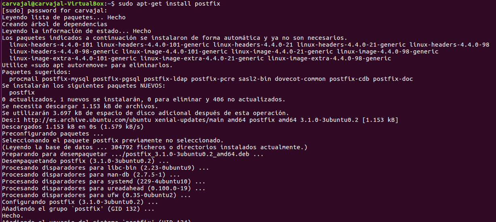

# Instalación y Configuración de un Servidor de Correo en Linux

Vamos a proceder a crear un servidor de correo como hicimos en Windows pero esta vez en Linux.

Máquinas a usar: **UbuntuServer**

## Instalar el SMTP.

Vamos a utilizar la herramienta `Postfix`.

Nos aparecerá una pantalla de configuración. Utilizamos la opción **Sitio de Internet** ya que necesitamos que el correo use SMTP.

Creamos dominio.

Comprobamos el servicio SMTP activo.

**FALTA PRUEBA DE ENVÍO**

## Servicio de correo Evolution.

Ahora instalaremos un cliente de correo. En nuestro caso el `Evolution`.

Listo. Ahora crearemos nuevas entradas asociadas a la IP del servidor para establecer conexión.

Ahora debemos crear usuarios en Evolution.

**FALTA CREAR CUENTAS Y ENVIAR CORREOS**

## SquirrelMail.

Instalar el servicio IMAP.

Visualizamos.

