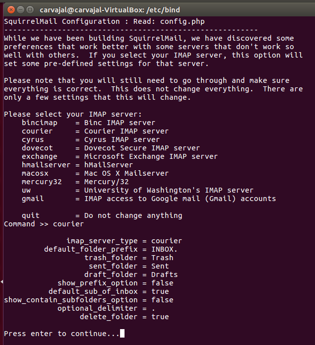

# Instalación y Configuración de un Servidor de Correo en Linux

Vamos a proceder a crear un servidor de correo como hicimos en Windows pero esta vez en Linux.

Máquinas a usar: **UbuntuCliente**

## Servicio de correo electrónico junto con SquirrelMail.

Primero debemos instalar el servicio apache para nuestra práctica.

Ahora tenemos que instalar el servidor DNS para luego configurarlo.

Configuramos el DNS.

Debemos crear un archivo para nuestro proyecto con el nombre dado anteriormente.

Insertamos valores en este archivo.

Reiniciamos el demonio para efectuar los cambios.

Ahora necesitamos un servicio de correo. *sudo apt-get install postfix* Y lo tomamos como **Sitio de Internet**. Además, le ponemos el nombre de nuestra página de correo.

Configuramos el siguiente archivo en la siguiente ruta para nuestro Postfix.

Reiniciamos el demonio de Postfix.

Procedemos a instalar un servidor de correo electrónico o mail. *sudo apt-get install courier-pop*. En la siguiente ventana le decimos que *No*.

Instalamos el courier-imap.

Ahora debemos instalar un mailx para enviar y recibir correo electrónico mediante la línea de comandos.

Instalamos una aplicación webmail como SquirrelMail.

Ahora lo configuramos yendo a **sudo squirrelmail-configure**. Nos saldrá una pantalla en la que debemos escribir **D e Intro** para avanzar y nos saldrá esta paǵina.

Escribimos **courier**.

Pulsamos **2 e Intro.**

Pulsamos **1 e Intro** dos veces e insertamos nuestro dominio de correo. Hecho esto pulsamos **Q** y **Enter** junto con **Y** para salvar los cambios.

Hacemos un enlace simbólico.

Reiniciamos el demonio.

Ahora accedemos a la url **www.correoweb.com/webmail** y ya tenemos nuestro correo instalado.

Y ya tenemos todo listo para enviar y recibir correos.
