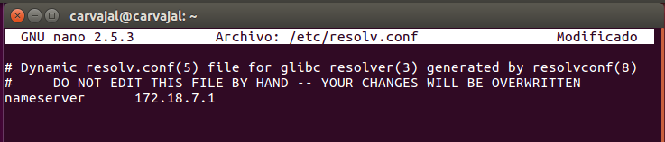
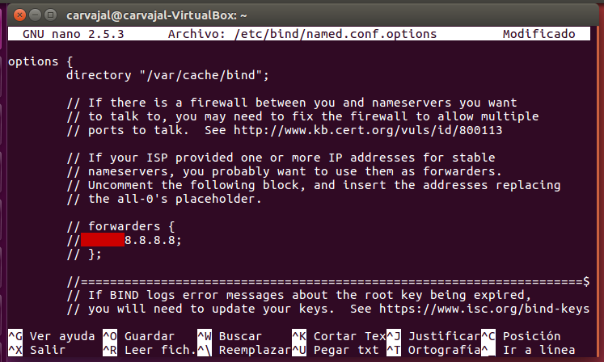
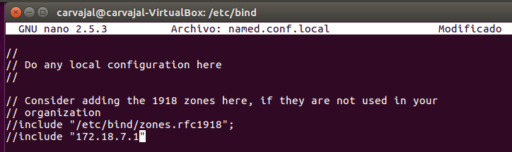
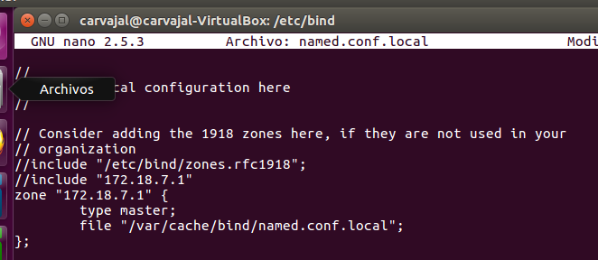
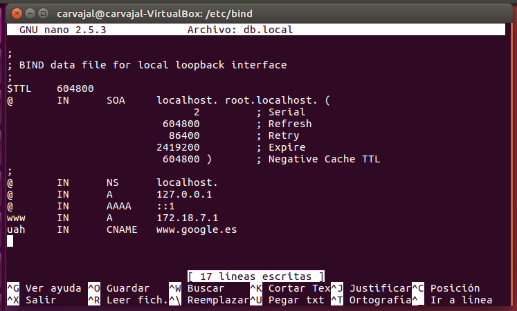
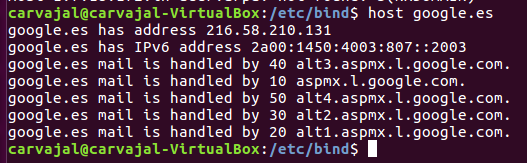

# Configuración de servicio DNS bind9

En esta práctica necesitamos instalar en nuestro SO Linux el programa `bind9` por medio de la línea de comandos con `apt-get install bind9`.

Una vez instalado nos debemos mover a `/etc/resolv.conf` para insertar unas líneas que signifiquen que el servidor DNS es él mismo.

Hecho esto ahora debemos configurar el servidor como cahé DNS. Para ello debemos insertar reenviadores de DNs con DNS públicos como la imagen de arriba.

Insertamos en la siguiente ruta un dominio ficticio e insertamos unas lineas para la redirección de búsqueda directa e inversa.

Como penúltimo paso debemos acceder a `db.local` y añadir unas sentencias que usaremos como prueba de que los nombres se resuelven.

Terminado este paso, debemos comprobar que los nombres entre servidor y cliente se resuelven.

