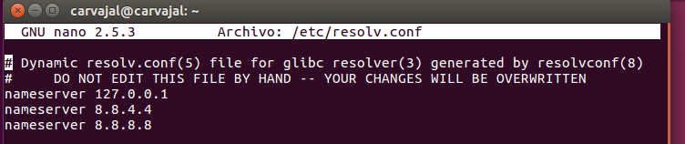

# Configuración de servicio DNS bind9

En esta práctica necesitamos instalar en nuestro SO Linux el programa `bind9` por medio de la línea de comandos con `apt-get install bind9`.

Una vez instalado nos debemos mover a `/etc/resolv.conf` para insertar unas líneas que signifiquen que el servidor DNS es él mismo.

Hecho esto

