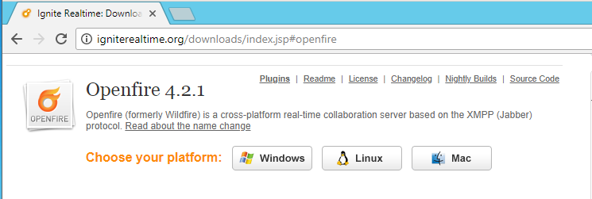

# Mensajería Instantánea

Máquinas requeridas: **Windows12Server**

## Openfire

Openfire es un sistema de mensajería instantánea GPL hecho en java y utiliza el protocolo jabber con el podrás tener tu propio servidor de mensajería.

Vamos a la página oficial y descargamos el archivo.

