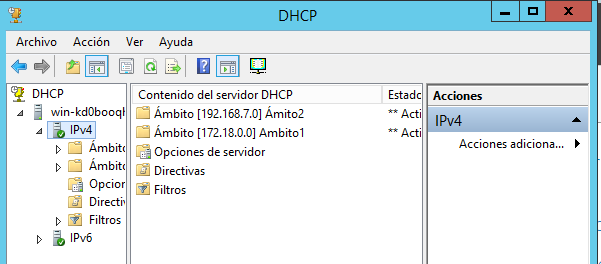
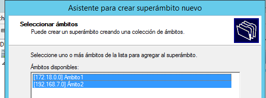
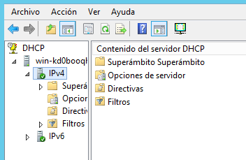

# Administración de un servidor DHCP
En esta práctica vamos a monitorizar un servicio DHCP en una máquina Windows Server 2012.

- Lo primero que debemos hacer es instalar el servicio DHCP.

- Cuando termine la instalación ir a `Herramientas -> Servidor DHCP`

- Creamos un nuevo ámbito e insertamos el rango de IPs que vamos a dar a los demás equipos.

- Ahora vamos a agregar rangos de IP que no se vayan a colocar a los equipos ya que están reservados.

- Tenemos que insertar una puerta de enlace que en este caso será `172.18.0.1`

- Insertamos el DNS en su defecto `8.8.4.4`

- Con el uĺtimo paso aceptamos y terminamos el primer ámbito.

- Como método de análisis de IP, ejecutamos el comando `ipconfig`

- Crearemos un segundo ámbito cuya información sea complementaria con el anterior.

- En el paso anterior deberíamos insertar unas direcciones distintas por que nos pueden dar problemas. Aceptamos y creamos el segundo ámbito.

- Como último paso, debemos crear un súper ámbito que una los dos ámbitos anteriores.

- Aceptamos y ya tenemos nuestro súper ámbito.

- En la imagen de arriba ponemos como primera la dirección IP de nuestra propia máquina hasta un número no muy alto como prueba de que funciona el servicio DHCP. Agregamos exclusiones a nuestro DHCP. Son direcciones que no tomarán los nuevos equipos.

- Ponemos una puerta de enlace para nuestras conexiones.

- También tenemos que configurar el DNS.

- Ya tenemos creado el primer ámbito con el DHCP configurado.

- La siguiente imagen es de la máquina cliente que podemos observar que haciendo un `ipconfig` la dirección IP del cliente cambia.

- A continuación, crearemos otro ámbito. Lo haremos con unas credenciales y unas IP distintas al anterior ámbito.

- Aceptamos y creamos el segundo ámbito.

- Como paso final vamos a crear un súper ámbito que recoja los dos ámbitos anteriores.

- Aceptamos y ya tenemos nuestro súper ámbito.

