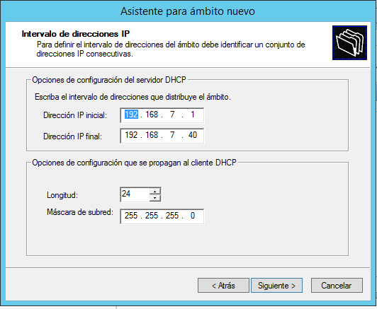

# Administración de un servidor DHCP
En esta práctica vamos a monitorizar un servicio DHCP en una máquina Windows Server 2012.

- Lo primero que debemos hacer es instalar el servicio DHCP.

- Cuando termine la instalación ir a `Herramientas -> Servidor DHCP`

- Creamos un nuevo ámbito e insertamos el rango de IPs que vamos a dar a los demás equipos.

- En la imagen de arriba ponemos como primera la dirección IP de nuestra propia máquina hasta un número no muy alto como prueba de que funciona el servicio DHCP. Agregamos exclusiones a nuestro DHCP. Son direcciones que no tomarán los nuevos equipos. 

- Ponemos una puerta de enlace para nuestras conexiones.

- También tenemos que configurar el DNS.

- Ya tenemos creado el primer ámbito con el DHCP configurado.

- La siguiente imagen es de la máquina cliente que podemos observar que haciendo un `ipconfig` la dirección IP del cliente cambia.

- A continuación, crearemos otro ámbito. Lo haremos con unas credenciales y una información parecida a la anterior.

