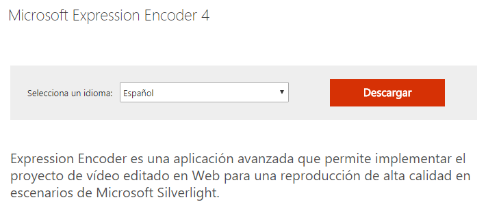
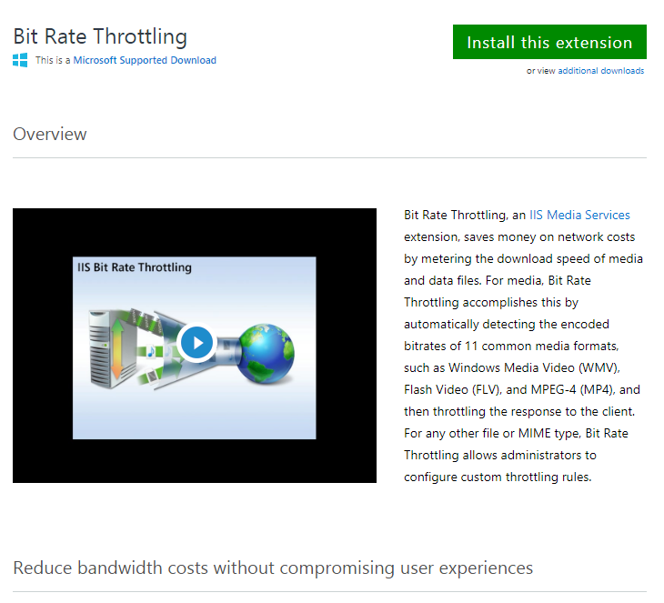

# Instalación y configuración de un servidor multimedia - Smooth Streaming

MV: **Windows12Server**

En esta práctica vamos a instalar un servicio multimedia de streaming.

## Servicios de multimedia 4.1 de IIS.

Lo primero que debemos hacer es instalar los servicios de IIS.

## Smooth Streaming Player

Vamos al moodle del instituto y descargamos de ahí el programa.

Nos queda un archivo en el escritorio.

Nos quedan estos archivos.

En esos archivos hay un HTML que es necesario configurar para la transmisión del vídeo que deseamos.

Necesitamos copiar los archivos que hemos visto antes y copiarlos en el DNS que tenemos que crear para nuestro servicio multimedia.

Debemos descargar los vídeos de la práctica.

Creamos dos sitios web en el IIS de elefante y conejo.

Cambiamos el archivo HTML de uno de los vídeos para que salga nuestro archivo especificado. Antes de esto, hemos copiado y pegado los archivos del media player en las carpetas convenientes.

## Expression Encoder

Vamos a instalar el servicio llamado Expression Encoder para usar sus preferencias.

## IIS Media

Nuestro siguiente paso serái ir a la página oficial de IIS para descargarnos el programa que también nos servirá para nuestro proyecto. https://www.iis.net/downloads/category/serve-media

Usaremos este programa.

Bajamos en la página e instalamos x64 ó x86 según nuestro ordenador.

## Microsoft Silverlight

Para poder usar estas herramientas debemos instalar el Microsoft Silverlight. https://www.microsoft.com/getsilverlight/get-started/install/default?reason=unsupportedbrowser&_helpmsg=FirefoxObsoleteForSL#sysreq

## Volviendo al IIS.

Entramos en el IIS y vemos que se han añadido programas.

Podemos ver sus características y opciones.

