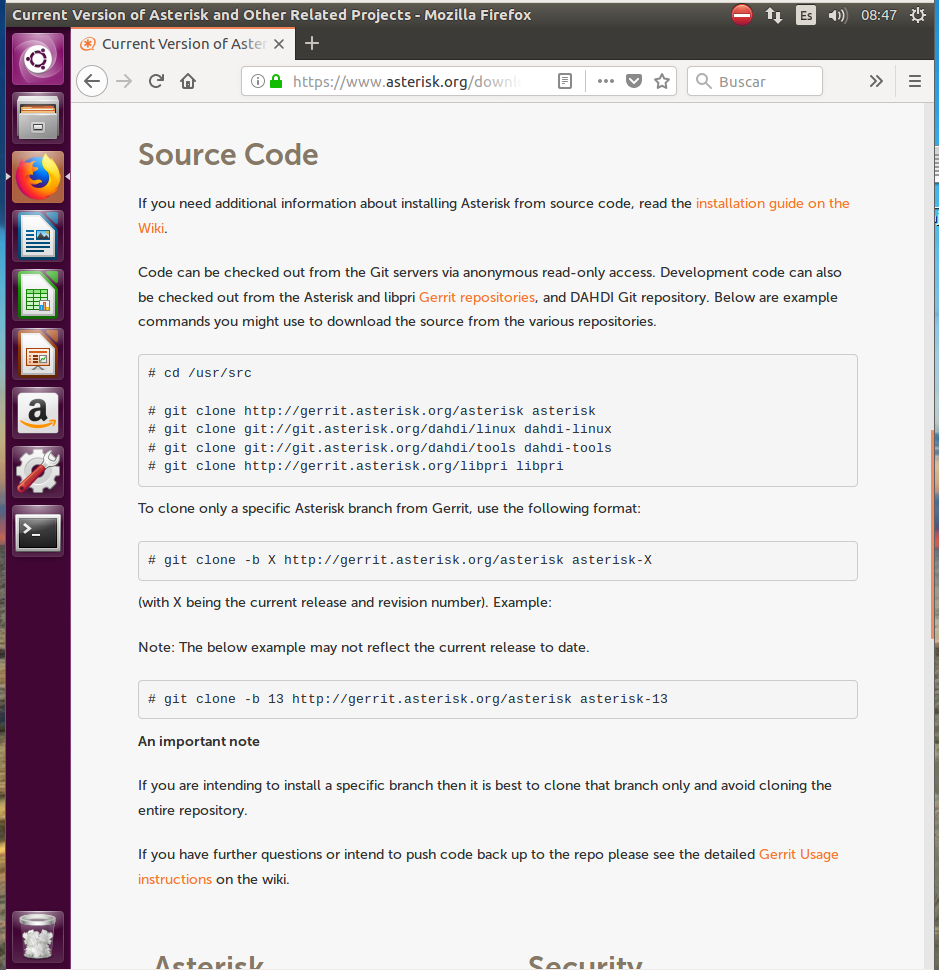
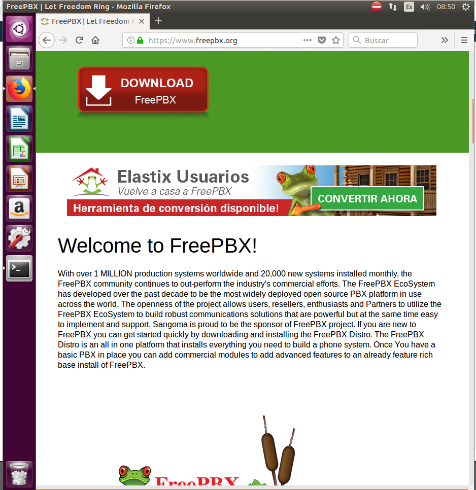

# Instalación y configuración del servicio VoIP

Máquina virtual **UBUNTUPARAMI**

Como servidor, descargar el PBX Asterisk de http://www.asterisk.org y el mantenimiento web FreePBX de http://www.freepbx.org

Como cliente, descargar el software adecuado para sistemas Linux que soporte 3CX Phone para sistemas Windows. Un ejemplo es http://ekiga.org
