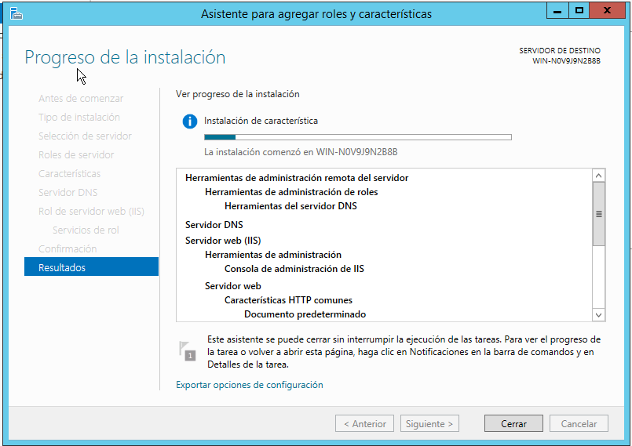
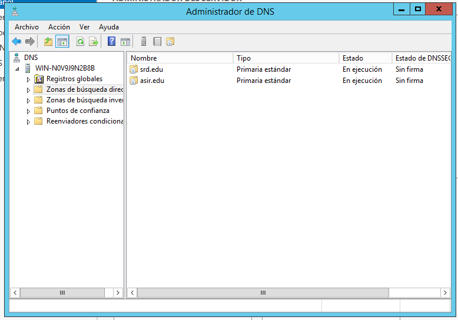
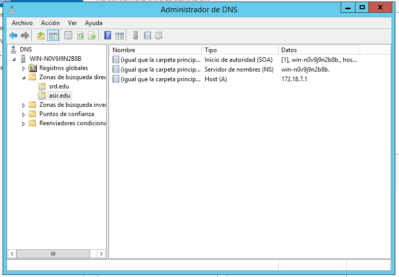
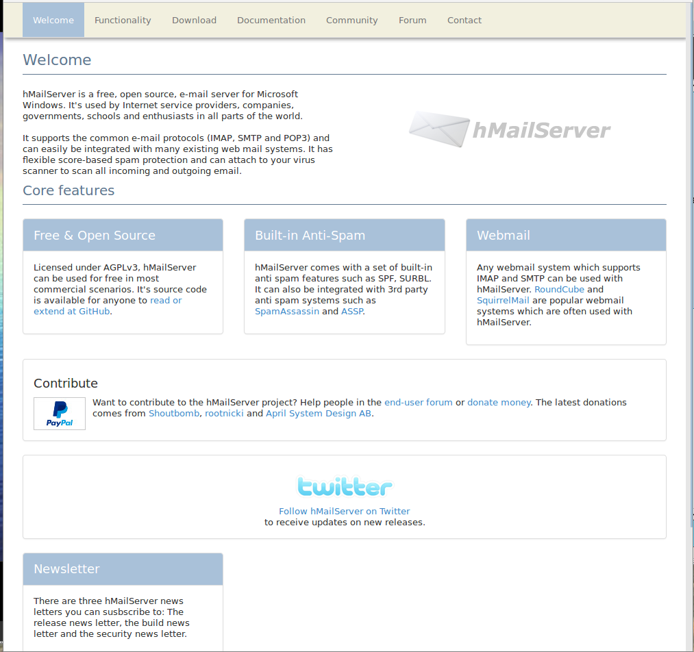
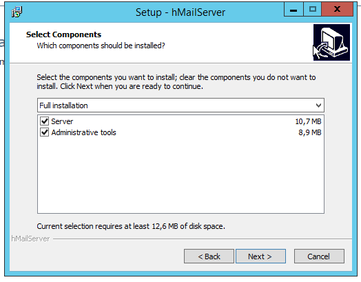
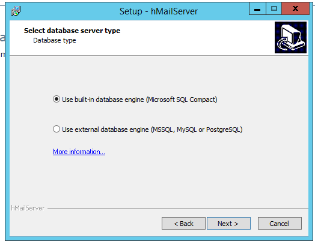
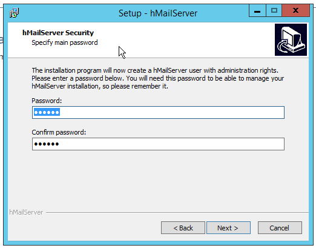
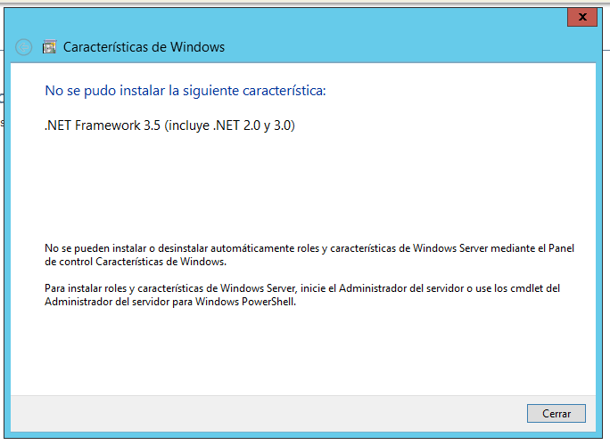
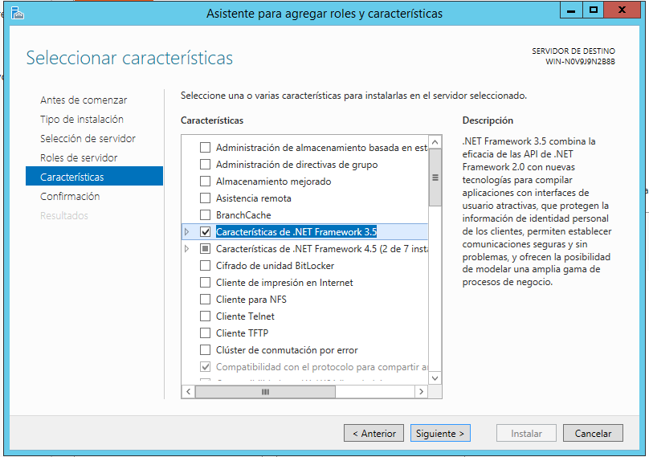

# hMailServer

En esta práctica vamos a instalar y configurar el servicio *hMailServer*.

Máquinas virtuales - **Windows12Server**

## Configuración inicial.

Debemos instalar el servidor DNS primero.

Creamos dos zonas de búsqueda directa para el correo.

Las dos tienen que apuntar al propio servidor.

## hMailServer

Hecho esto, vamos a descargar de la página oficial https://www.hmailserver.com/ el servicio de correo.

En este paso nos crea una pequeña base de datos que viene predeterminada.

Una contraseña para el servidor. La nuestra es del 1 al 6.

----------------------------

#### Posibles errores

En este caso primero instalamos esa característica.

Si no se consigue solventar así, desde agregar roles y características.

----------------------------
